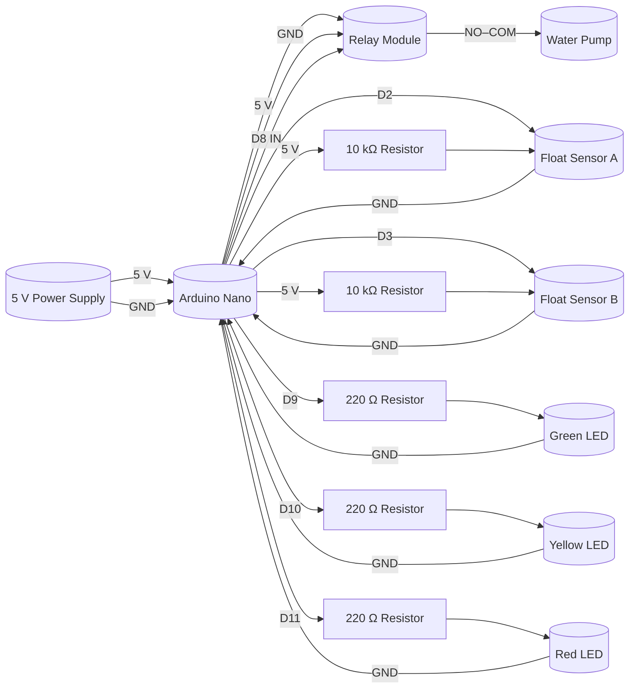

# Shower Pump

Like the name suggests, this is Arduino code to control my shower pump to evacuate water from the shower. The pump is controlled by a relay module, and the code uses two float sensors to detect the water level in the shower. The code is designed to be used with an Arduino Nano but can be easily adapted to other Arduino boards.

## Components

-   **Arduino Nano**
-   **Relay module** (5 V coil)
-   **2 float sensors** (A & B)
-   **Water pump** (230 V AC, controlled by relay contacts)
-   **3 LEDs** (green, yellow, red)
-   **3 × 220 Ω resistors** (LED current-limit)
-   **2 × 10 kΩ resistors** (pull-up for float sensors, if not using `INPUT_PULLUP`)
-   **Power supply** (5 V regulated or VIN ≥ 7 V via onboard regulator)

## Circuit Diagram

## Wiring

1. **Power**

    - Supply 5 V to the Nano’s **5 V** pin (or ≥ 7 V to **VIN**).
    - Common **GND** for Nano, relay module and sensors.

2. **Float Sensors**

    - Sensor A → **D2**; other leg → **GND**.
    - Sensor B → **D3**; other leg → **GND**.
    - Pull-up resistors: either internal (`INPUT_PULLUP`) or externals (10 kΩ between 5 V and each sensor pin).

3. **Relay Module**

    - **VCC** → 5 V
    - **GND** → GND
    - **IN** → **D8**
    - **NO–COM** contacts switch the pump’s 230 V live line.

4. **LED Indicators**
    - **Green LED** → D9 → 220 Ω → LED → GND
    - **Yellow LED** → D10 → 220 Ω → LED → GND
    - **Red LED** → D11 → 220 Ω → LED → GND

## Usage

1. Upload the Arduino sketch.
2. On power-up, the system defaults to **Sleep Mode** (green LED blinks every 30 s).
3. When water rises between the two sensors, the pump runs until the bottom sensor is low.
4. After 5 min of inactivity it returns to Sleep Mode.
5. In **Shower Mode** (both sensors high), LEDs indicate:
    - **Yellow fixed** during rise between sensors,
    - **Yellow blinking** at 1 Hz when pump starts,
    - **Green steady** when waiting,
    - **Red** if high level persists > 2 min without pump cycle.

---

_All wiring and components should be housed safely, especially the 230 V connections to the pump. Always follow proper electrical safety practices._

